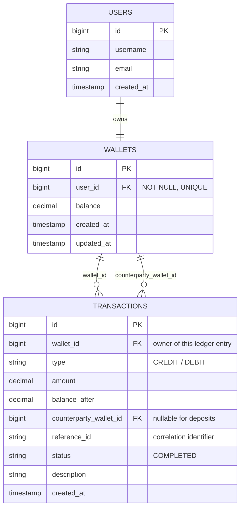

# 💳 Digital Wallet

A backend system designed to provide users with a secure and reliable way to manage their digital money.

The system focuses on managing users' wallets and financial transactions while maintaining data consistency, transaction integrity, and accurate financial records.

---

## 📌 Project Overview

The **Digital Wallet** is a backend system designed to provide users with a secure and reliable way to manage their digital money.

The system focuses on managing users' wallets and financial transactions while maintaining data consistency, transaction integrity, and accurate financial records.

The project aims to provide a robust foundation for handling digital wallet operations in a secure and reliable manner.

---

## ⚙️ Functional Requirements

### 👤 User & Wallet Management

- The system must support creating a wallet for a user.
- The system must ensure that each user can have at most one wallet.
- The system must allow a user to retrieve their wallet balance.
- The system must validate wallet ownership before allowing wallet-related operations.

### 💰 Deposit

- The system must allow a user to deposit money into their wallet.
- The system must validate that the deposit amount is greater than zero.
- The system must update the wallet balance after a successful deposit.
- The system must record a transaction for every successful deposit.

### 🔄 Transfer

- The system must allow users to transfer money between wallets.
- The system must validate that the sender and receiver wallets are valid.
- The system must prevent transferring money to the same wallet.
- The system must validate that the sender has sufficient balance.
- The system must debit the sender's wallet and credit the receiver's wallet atomically.
- The system must record both sides of a successful transfer in the transaction ledger.

### 📜 Transaction History

- The system must allow users to retrieve their wallet transaction history.
- The system must support pagination.
- The system must support filtering transactions.
- The system must support sorting transactions.
- The system must return transaction status and relevant transaction details.

---

## 🛡️ Non-Functional Requirements

### 🔐 Security

- Wallet operations must validate ownership.
- Sensitive financial operations must not be partially completed.
- The system must validate all incoming data.

### 🧩 Data Integrity

- Wallet balances must remain consistent with successful financial operations.
- Transfers must be executed atomically.
- A successful transfer must create both the debit and credit ledger entries.
- Database constraints must enforce required relationships.

### ⚡ Performance

- Transaction history queries should be optimized for wallet-based lookups.
- Appropriate database indexes should be used for frequently queried fields.
- Pagination should be used to avoid loading large transaction histories at once.

### 📈 Scalability

- The design should allow the system to support increasing transaction volume.
- The transaction model should remain extensible for additional transaction types.

### 🧪 Reliability

- Failed financial operations must not leave partial balance updates.
- Database transactions should be used for operations that modify multiple records.

### 📝 Maintainability

- Business logic should be separated from controllers and data-access logic.
- The system should follow clear layering and separation of responsibilities.

---

## 👥 Business Roles

### 👤 User

A user can:

- Create a wallet.
- View their wallet balance.
- Deposit money.
- Transfer money to another wallet.
- View their transaction history.

### 🛠️ Admin

**Admin functionality is currently outside the core scope of the provided use case.**

---

# 🗄️ Database Design

## Entity Relationship Diagram



## 🎯 Design Approach

The database uses a **ledger-style transaction model**.

Each transaction row represents a balance movement from the perspective of one wallet.

### 💵 Deposit

A deposit represents money entering the wallet from outside the wallet system.

```text
External Source
      │
      │ +100
      ▼
   Wallet
```

It creates one ledger entry:

```text
wallet_id = 1
type = CREDIT
amount = 100
counterparty_wallet_id = NULL
```

The `NULL` value is intentional because there is no counterparty wallet inside the system.

### 🔄 Transfer

A transfer represents money moving between two wallets.

It creates two ledger entries sharing the same `reference_id`:

```text
Ahmed:
wallet_id = 1
type = DEBIT
amount = 100
counterparty_wallet_id = 2
reference_id = TX-123

Sara:
wallet_id = 2
type = CREDIT
amount = 100
counterparty_wallet_id = 1
reference_id = TX-123
```

This lets the system identify the other side of the transfer without nullable `sender_wallet_id` / `receiver_wallet_id` columns.

---

## 💡 Design Rationale

### 1. Ledger-style transaction model

Every balance movement is stored as its own ledger entry from the perspective of the wallet it belongs to.

This provides:

- 🔎 Simple wallet history queries.
- 📄 Straightforward pagination, filtering, and sorting.
- 🧾 Better auditability.
- ⚖️ Symmetric handling of sender and receiver.
- 🔗 Clear correlation between both sides of a transfer.

A wallet history query can be optimized with an index such as:

```sql
CREATE INDEX idx_transactions_wallet_created
ON transactions (wallet_id, created_at DESC);
```

### 2. `balance_after`

`balance_after` stores the wallet balance immediately after the ledger entry.

It makes historical statements easier to retrieve without recalculating the balance from all previous transactions.

> `balance_after` is an audit/history snapshot. It does not, by itself, guarantee balance consistency.

### 3. `reference_id`

`reference_id` acts as a correlation identifier for the financial operation.

For a transfer:

```text
reference_id = TX-123

DEBIT  → TX-123
CREDIT → TX-123
```

Idempotency should be handled separately using an idempotency key or an equivalent uniqueness constraint at the business-operation level.

### 4. One-to-one User–Wallet relationship

Each user can have at most one wallet in the current scope.

This is enforced by:

```text
wallets.user_id NOT NULL
UNIQUE(wallets.user_id)
```

### 5. Atomic financial operations

Transfers modify multiple records:

```text
Sender balance
Receiver balance
Sender ledger entry
Receiver ledger entry
```

These changes must be performed inside a single database transaction:

```text
BEGIN

Lock sender wallet
Lock receiver wallet

Validate sender balance

Debit sender
Credit receiver

Create DEBIT ledger entry
Create CREDIT ledger entry

COMMIT
```

If any step fails:

```text
ROLLBACK
```

This prevents partial transfers and protects data consistency.

---

## 🔍 How Sender / Receiver Is Identified

| Type | `wallet_id` represents | `counterparty_wallet_id` represents |
|---|---|---|
| `DEBIT` | Sender | Receiver |
| `CREDIT` | Receiver | Sender |

Example:

| wallet_id | type | amount | counterparty_wallet_id | reference_id |
|---:|---|---:|---:|---|
| 1 | DEBIT | 100 | 2 | TX-123 |
| 2 | CREDIT | 100 | 1 | TX-123 |

Therefore:

- `DEBIT` identifies the sender side.
- `CREDIT` identifies the receiver side.
- `counterparty_wallet_id` identifies the other wallet.
- `reference_id` connects both ledger entries to the same transfer.

---

## 📏 Business Rules

- A user can own at most one wallet.
- A wallet balance cannot become negative.
- Deposit amounts must be greater than zero.
- Transfer amounts must be greater than zero.
- A wallet cannot transfer money to itself.
- The sender must have sufficient available balance.
- A successful transfer must produce one debit and one credit ledger entry.
- Both ledger entries of a transfer must share the same `reference_id`.
- Balance updates and ledger entries must be committed atomically.
- Successful ledger entries should be treated as immutable.
  
---
# Digital Wallet API

## Base URL

```text
http://localhost:8080/api/v1
```

## Authentication (Temporary)

Currently, there is no real authentication module.

For **all endpoints**, send the following header:

```text
X-User-Id: <userId>
```
---

## Endpoints

### 1. Create Wallet

Creates a new wallet for a user.

* **Method:** `POST`
* **URL:** `/wallets`

#### Headers

| Header         | Required | Description        |
| -------------- | -------- | ------------------ |
| `Content-Type` | Yes      | `application/json` |
| `X-User-Id`    | Yes      | ID of the user     |

#### Request Body

```json
{}
```

#### Success Response

**201 Created**

```json
{
  "id": 1,
  "userId": 1,
  "balance": 0.00,
  "createdAt": "2025-01-15T10:30:00",
  "updatedAt": "2025-01-15T10:30:00"
}
```

#### Errors

* **400 Bad Request** — Invalid request data.
* **401 Unauthorized** — `X-User-Id` header is missing or invalid.
* **409 Conflict** — Wallet already exists for this user.
* **500 Internal Server Error** — Unexpected server error.

### 2. Get Wallet Balance

Retrieves the current balance of a wallet.

- **Method:** GET
- **URL:** `/wallets/{walletId}/balance`

- **Path Parameters:**
    - `walletId` (`Long`) — required

- **Headers:**
    - `X-User-Id: <userId>` — required

- **Success Response:** `200 OK`

  ```json
  {
    "walletId": 1,
    "balance": 1250.00
  }
  

#### Errors

- **400 Bad Request** — Invalid `walletId`.
- **400 Bad Request** — `X-User-Id` header is missing.
- **404 Not Found** — Wallet does not exist.
- **403 Forbidden** — User does not own this wallet.
